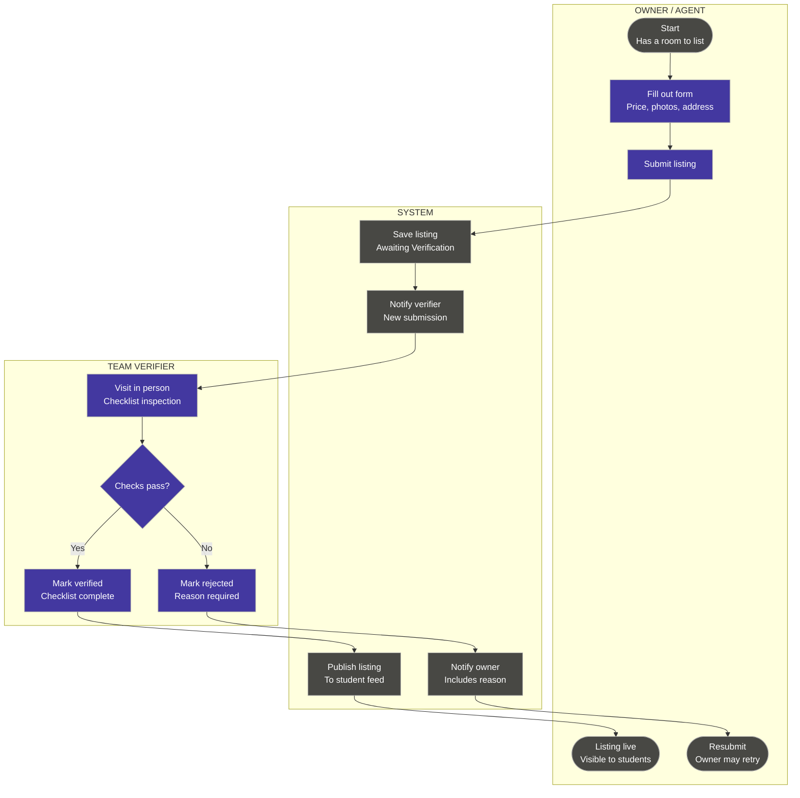

# Activity Diagram — Listing Submission & Verification Workflow

**Scope:** Our core workflow; one swimlane per role and one for the system; every decision labelled with guards; start and end nodes.

**Key:** each outlined box is a swimlane (one role or the system), read left to right in the order responsibility passes; rounded nodes = start/end; rectangles = actions; diamond = decision, with the guard condition in brackets on each outgoing arrow.

**Traceability:** This is the workflow behind Experiments 1 and 2 on our JVB: a team member personally checks a listing before it reaches students. The "No" branch is our own addition, because our riskiest assumption (#3, owners willing to be verified) is still unvalidated, so some owners may decline or fail the check.
