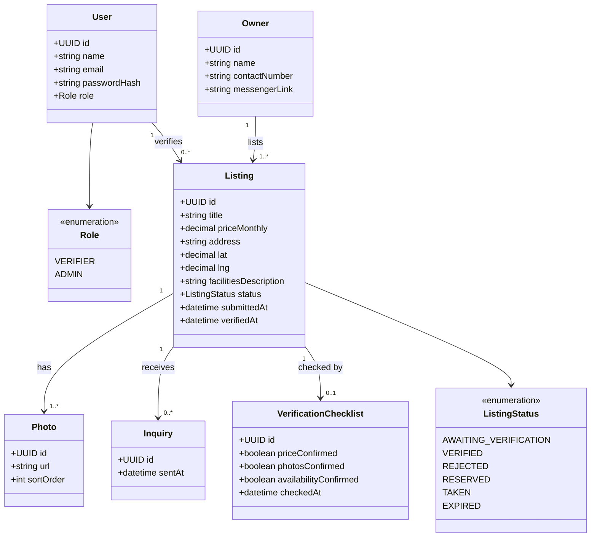

# Class Diagram — Boarding House Listing Verification Domain Model

**Scope:** 4–10 domain classes with typed attributes; multiplicity at both ends of every association; an enumeration for every status field.

**Key:** `+` = public attribute; `<<enumeration>>` = a fixed set of allowed values; `"1" --> "0..*"` reads as "one of the left side relates to zero or more of the right side."

**Traceability:** `VerificationChecklist` attributes mirror the actual check our team verifier performs (price, photos, availability) as described in our Solution box on the Lean Canvas and JVB. `Inquiry` is the class our JVB success metric counts. `ListingStatus` values match the Activity and State Machine diagrams exactly. 
