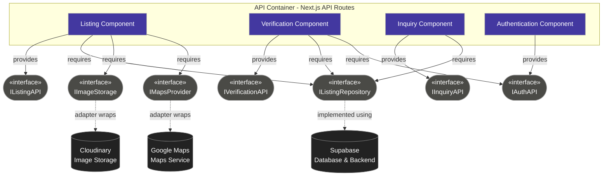

# UML Component Diagram — API Container

**Scope:** Our API container; the interfaces each component provides and requires; external services kept behind an adapter interface. 

**Key:** rectangles = components; lollipop-style rounded nodes = interfaces; solid arrows = provides/requires; dashed arrows = an adapter wrapping an external service, so no component talks to Cloudinary, Google Maps, or Supabase directly.

**Traceability:** Keeping every external service (Cloudinary, Google Maps, Supabase) behind its own interface means a future swap — e.g., replacing Cloudinary with Supabase Storage — only touches the adapter, not the Listing or Verification components.
