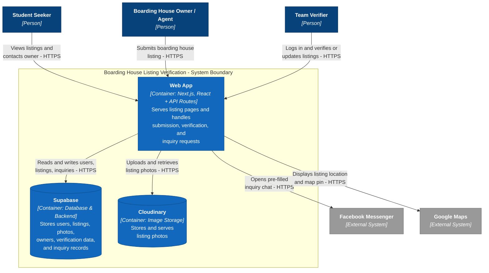

# C4 Container Diagram — Boarding House Listing Verification

**Scope:** Every separately deployable unit with its technology; every arrow labelled with intent and protocol.

**Key:** dark-blue boxes = people; medium-blue boxes inside the outlined boundary = our containers (cylinder shape = a database/storage container); grey boxes = external systems. Arrows are labelled "intent — protocol."
 
**One-sentence container decision:** We draw our Next.js app as a **single container**, because its pages and API routes are built and deployed together as one unit on Vercel — we have no separate backend service at MVP stage.
