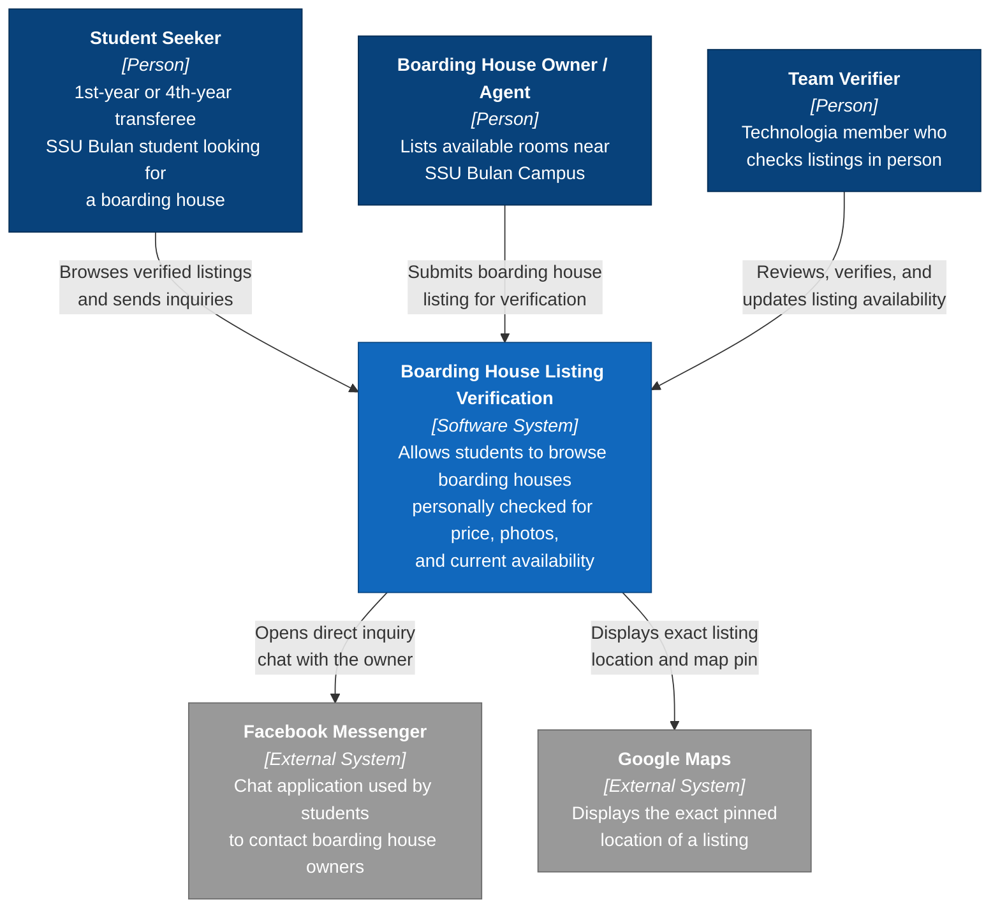

# C4 System Context Diagram — Boarding House Listing Verification

**Scope:** The whole MVP as one box, every user role, and every external system it depends on.

**Key:** dark-blue boxes = people (actors); medium-blue box = our system (center of the diagram); grey boxes = external systems we depend on but do not own. Every arrow is labelled with the intent of that interaction, not just "uses." 

**Traceability:** Student Seeker, Boarding House Owner/Agent, and Team Verifier are the same three roles validated in Experiment 1 of our Javelin Validation Board (JVB) and named in our Lean Canvas Customer Segments / Early Adopters boxes. Facebook Messenger and Google Maps are carried over directly from the "Bulan Barter" Facebook group channel we already validated — this MVP wraps a verification layer and a browsable list around that channel, it does not replace it.
