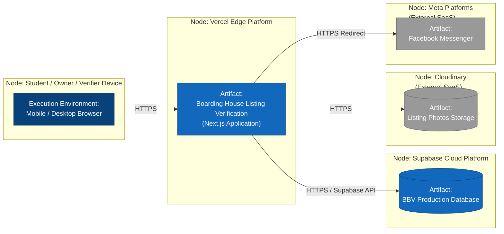

# Deployment Diagram — Provisional

**Scope:** Titled "Provisional"; nodes, execution environments, and artifacts; a protocol on every path; no secrets or real addresses.

**Key:** each outlined box is a node (a physical device or a cloud execution environment), read left to right as a request travels outward; the inner box or cylinder inside each node is the artifact (a deployed build or dataset) running there; every arrow carries its protocol.

**Why "Provisional":** we have not yet signed up for Vercel, Supabase, or Cloudinary accounts — these are our planned providers based on the Next.js stack, not confirmed infrastructure. No real hostnames, API keys, or connection strings appear here.
