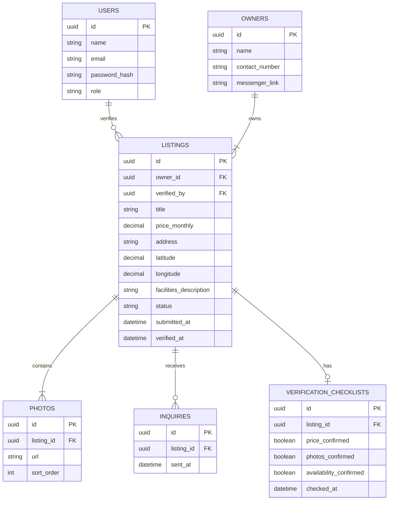

# Draft ERD — Boarding House Listing Verification

**Scope:** One table per stored class; primary and foreign keys; crow's-foot cardinality matching our class diagram; PII columns marked.

**Key:** `||` = exactly one, `o{` = zero or many, `|{` = one or many, `o|` = zero or one (crow's-foot notation). `"PII"` marks columns holding personally identifiable information.

**Cardinality check against class.md:** `USERS ||--o{ LISTINGS` matches `User "1" --> "0..*" Listing`; `OWNERS ||--|{ LISTINGS` matches `Owner "1" --> "1..*" Listing`; `LISTINGS ||--|{ PHOTOS` matches `Listing "1" --> "1..*" Photo`; `LISTINGS ||--o{ INQUIRIES` matches `Listing "1" --> "0..*" Inquiry`; `LISTINGS ||--o| VERIFICATION_CHECKLISTS` matches `Listing "1" --> "0..1" VerificationChecklist`.
