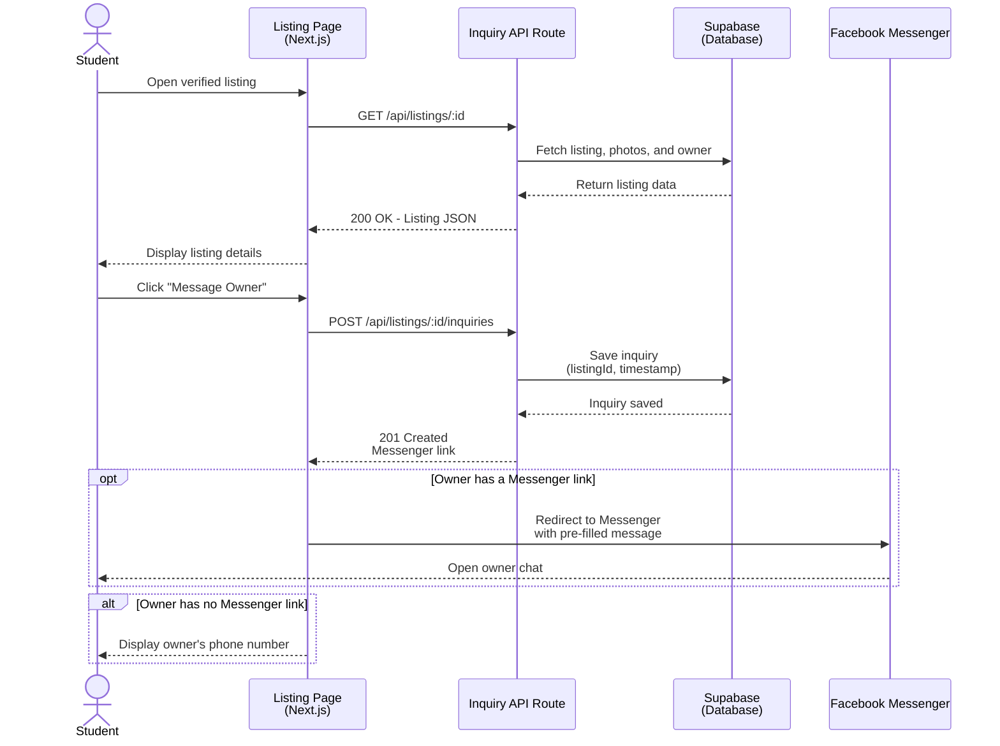

# Sequence Diagram — Student Views a Listing and Sends an Inquiry

**Scope:** Our riskiest flow (it is literally our JVB success metric); replies drawn; branches shown with alt/opt; an external system (Facebook Messenger) as a lifeline.

**Key:** solid arrows = request, dashed arrows = reply; `opt` = optional branch; `alt` = either/or branch. 

**Why this is our riskiest flow:** every inquiry logged here is exactly what our JVB Success Criterion counts ("at least 15 of ~50 students message the post within 5 days"). If this flow breaks or undercounts, we cannot tell whether an experiment passed or failed.
