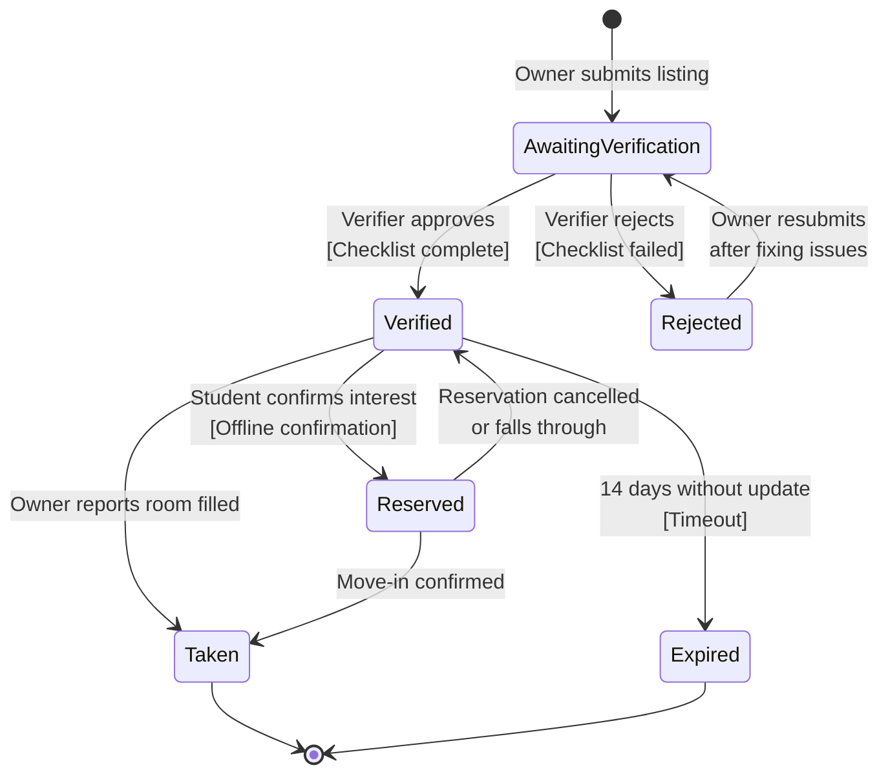

# State Machine Diagram — Listing Status

**Scope:** Our main entity (the object with a status field); initial and final states; states named as conditions; every transition labelled with its event.

**Key:** `[*]` = initial/final pseudo-state; arrow labels after the colon are the triggering event, bracketed text is the guard condition.
 
**Traceability:** These six states are exactly the six values of the `ListingStatus` enumeration in `class.md`. `AwaitingVerification → Verified` is the same decision point drawn as a guarded branch in `activity.md`.
