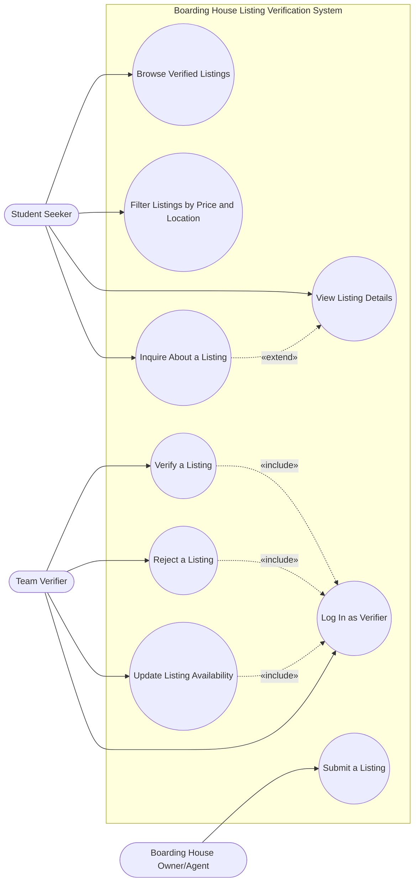

# Use Case Diagram — Boarding House Listing Verification

**Scope:** Every actor from the context diagram; 5–12 goal-level use cases named verb + object, taken from our MVP feature list. 

**Key:** rounded rectangles = actors; double-ringed circles = use cases; solid arrows = actor participation; dashed arrows = «include»/«extend» relationships.

**Why each use case matters (primary audience / risk reduced):** 

| Use case | Primary audience | Risk it reduces |
|---|---|---|
| Browse Verified Listings | Student Seeker | Students waste fare/load chasing outdated posts (our core validated problem) |
| Filter Listings by Price and Location | Student Seeker | Students can't quickly narrow ~50 listings to ones they can afford/reach |
| View Listing Details | Student Seeker | Experiment 1 learning: students want facilities & exact location, not just price |
| Inquire About a Listing | Student Seeker | This is literally our JVB success metric — counts as our "message the post" signal |
| Submit a Listing | Owner/Agent | Owners need a low-friction way to get a listing in front of the verifier |
| Verify a Listing | Team Verifier | De-risks JVB Assumption #3 — owner willingness to be verified |
| Reject a Listing | Team Verifier | Keeps unverifiable/inaccurate listings out of the feed |
| Update Listing Availability | Team Verifier | Prevents the "already taken" problem reported by C.G. and J.G. |
| Log In as Verifier | Team Verifier | Only trusted team members can mark something "Verified" |
